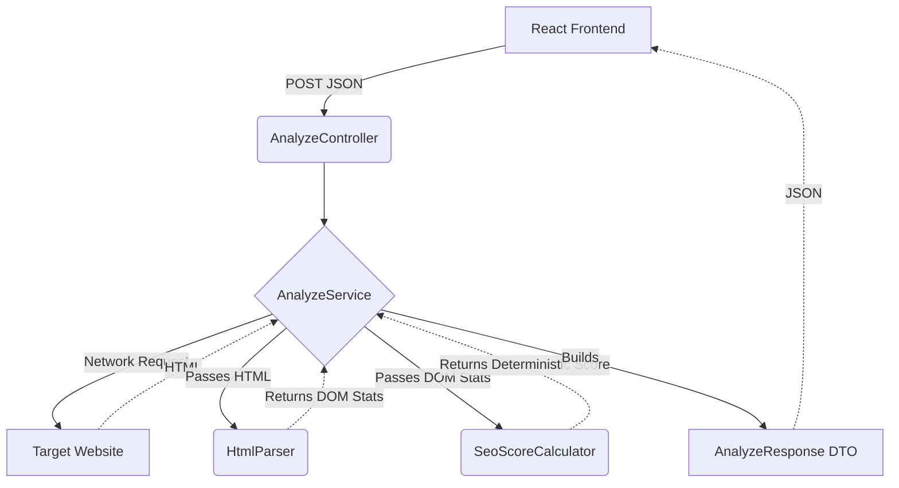

# PageLens Backend – Website Intelligence Engine

PageLens is a production-quality Spring Boot backend that performs real-time website analysis. It securely fetches, parses, and evaluates websites to generate deterministic technical SEO intelligence without relying on arbitrary heuristics or AI generation.

---

## Architecture Diagram

The system follows a strict Clean Architecture model, ensuring clear separation of concerns across layers.



---

## Package Structure

The project strictly avoids flattening to enforce domain boundaries:

- `com.pagelens.controller`: Extremely thin REST layer. Only handles HTTP mapping and payload validation.
- `com.pagelens.service`: Orchestrates the networking, timing, and integration between the parser and scoring engine.
- `com.pagelens.parser`: Pure DOM extraction using Jsoup. Contains zero networking logic.
- `com.pagelens.util`: Centralized constants, strict URL validation, and the deterministic SEO evaluation engine.
- `com.pagelens.dto`: Immutable data carriers for requests and responses. Contains zero business logic.
- `com.pagelens.exception`: Domain-specific error definitions and the `@RestControllerAdvice` global exception handler.

---

## API Reference

### `POST /api/v1/analyze`

Triggers a real-time analysis of the target URL.

**Request:**
```json
{
  "url": "https://example.com"
}
```

**Success Response (200 OK):**
```json
{
  "url": "https://example.com",
  "domain": "example.com",
  "analyzedAt": "2026-07-24T18:00:00.000",
  "httpStatus": 200,
  "responseTime": 350,
  "pageTitle": "Example Domain",
  "metaDescription": "",
  "favicon": "",
  "charset": "UTF-8",
  "language": "",
  "wordCount": 150,
  "sslEnabled": true,
  "viewportAvailable": true,
  "robotsTxtFound": false,
  "sitemapFound": false,
  "seoScore": 75,
  "seoGrade": "C",
  "headings": {
    "h1Text": "Example Domain",
    "h1Count": 1,
    "h2Count": 0,
    "h3Count": 0,
    "h4Count": 0
  },
  "images": {
    "totalImages": 0,
    "imagesWithAlt": 0,
    "imagesMissingAlt": 0
  },
  "seoBreakdown": {
    "https": true,
    "metaDescription": false,
    "singleH1": true,
    "imageAlt": true,
    "contentLength": false,
    "viewport": true,
    "charset": true,
    "robots": false,
    "sitemap": false
  }
}
```

**Error Response Format (e.g., 400, 502, 504):**
Every error uniformly matches this structure, ensuring the frontend never crashes on an unexpected trace.
```json
{
  "timestamp": "2026-07-24T18:00:05.000",
  "status": 400,
  "error": "Invalid URL",
  "message": "Please enter a valid HTTP or HTTPS URL.",
  "path": "/api/v1/analyze"
}
```

---

## Engineering Decisions

1. **Why Jsoup was chosen:** Jsoup provides both robust network fetching and HTML parsing in one lightweight, mature library. Unlike regex, it accurately handles malformed DOMs, and unlike headless browsers (Puppeteer/Selenium), it requires no heavy runtime infrastructure, keeping the backend blazingly fast.
2. **Why Parser and Service are separated:** The `HtmlParser` is strictly isolated from the `AnalyzeService`. The service handles network timeouts, I/O streams, and protocols, while the parser only understands a `Document`. This makes unit testing the parser trivial (using local strings) without mocking HTTP servers.
3. **Why the SEO engine is deterministic:** Generating scores via AI or arbitrary heuristics is useless for technical diagnostics. The `SeoScoreCalculator` uses a strict 100-point sum model, meaning two identical websites will *always* result in the same explainable score.
4. **Why DTOs contain no business logic:** DTOs are data carriers. Embedding formatting, parsing, or validation methods inside them blurs architectural boundaries and complicates serialization. 
5. **Why no database is used (yet):** Technical analysis requires fetching live data. Caching and historical storage belong in a separate architectural tier (e.g., Redis/Postgres) which would be added via a caching interface without touching the core orchestration flow.

---

## Developer Instructions

### Prerequisites
- Java 17+

### Running the Application
A Maven wrapper is included, so no local Maven installation is required.

**Build and Run Tests:**
```bash
./mvnw clean test
```

**Start the Server:**
```bash
./mvnw spring-boot:run
```
The server will start on `http://localhost:8080`.

### Environment Variables
For production deployment, you can override properties:
- `PORT`: (default 8080)
- `ANALYSIS_TIMEOUT_MS`: (default 10000)
- `LOGGING_LEVEL_ROOT`: (default INFO)
